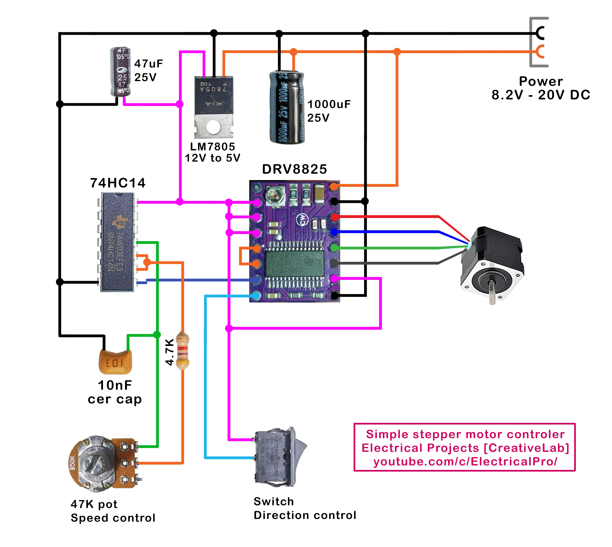

# Stepper Motor Controller Without Arduino or Microcontrollers
Watch video about this project:
https://youtu.be/HdTU3Mj1Ejs

This is the curcuit:

# Components
Motor I've used: [https://s.click.aliexpress.com/e/_d84I07S](https://s.click.aliexpress.com/e/_d84I07S)

PCB 4X6: [https://s.click.aliexpress.com/e/_d65i2Sg](https://s.click.aliexpress.com/e/_DlxggA5)

PCB 6X8: [https://s.click.aliexpress.com/e/_d7XpQnS](https://s.click.aliexpress.com/e/_DlxggA5)

DVR8825 stepper motor driver: [https://s.click.aliexpress.com/e/_Anmk61](https://s.click.aliexpress.com/e/_DdbsVY5)

SN74HC14N: [https://s.click.aliexpress.com/e/_A5CxRn](https://s.click.aliexpress.com/e/_A5CxRn)

LM7805: [https://s.click.aliexpress.com/e/_AVukJx](https://s.click.aliexpress.com/e/_AVukJx)

Switch: [https://s.click.aliexpress.com/e/_Apb1l7](https://s.click.aliexpress.com/e/_Apb1l7)

50k Potentiometer: [https://s.click.aliexpress.com/e/_AgNoGN](https://s.click.aliexpress.com/e/_Dl5W2UD)

Pin Header: [https://s.click.aliexpress.com/e/_DdOig6l](https://s.click.aliexpress.com/e/_DdOig6l)

Female PCB Header: [https://s.click.aliexpress.com/e/_DDBKykp](https://s.click.aliexpress.com/e/_DDBKykp)

Electrolytic Capacitors: [https://s.click.aliexpress.com/e/_A2atvx](https://s.click.aliexpress.com/e/_A2atvx)

Ceramic Capacitors: [https://s.click.aliexpress.com/e/_ABg3GZ](https://s.click.aliexpress.com/e/_ABg3GZ)

Resistors: [https://s.click.aliexpress.com/e/_9AslPB](https://s.click.aliexpress.com/e/_9AslPB)
